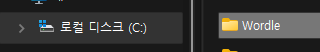

# Wordle

C를 사용하여 단어 데이터베이스에 기반한 Wordle 게임을 제작하였습니다.   

   

실제 존재하는 5글자 영어 단어를 입력하면서 6번의 시도 안에 정답을 맞추어야 합니다.

초록색 문자는 정답 단어와 문자 및 자리가 동일함을 보여주고   
노란색 문자는 정답 단어와 문자는 같으나 자리가 다름을 보여줍니다.   
흰색일 경우 정답 단어와 부합하지 않음을 보여줍니다.   

> 사용 시 유의사항

Wordle 폴더가 (C:) 디렉토리에 존재해야 합니다.  
실행은 wordle.exe 파일을 사용합니다.